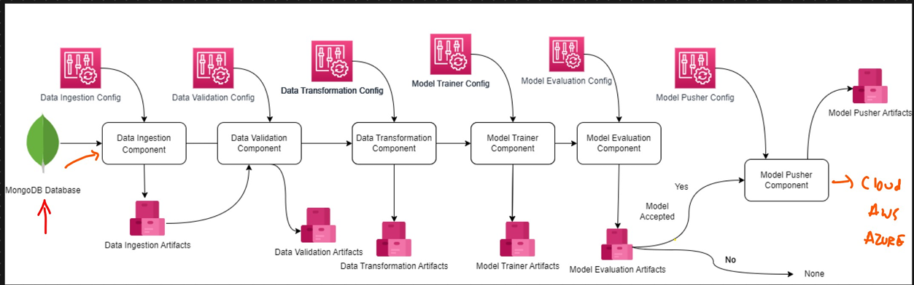
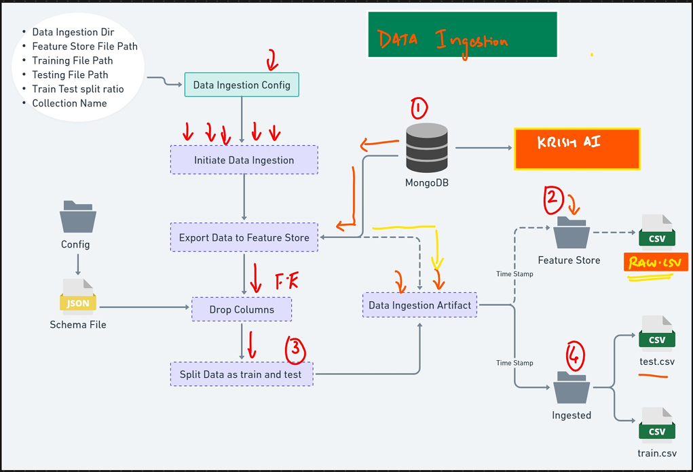
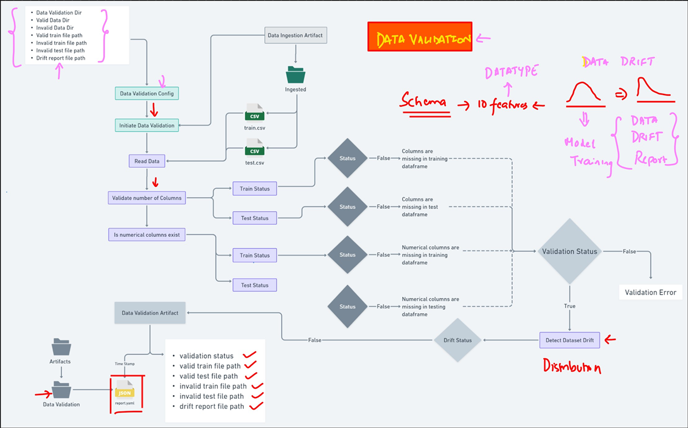
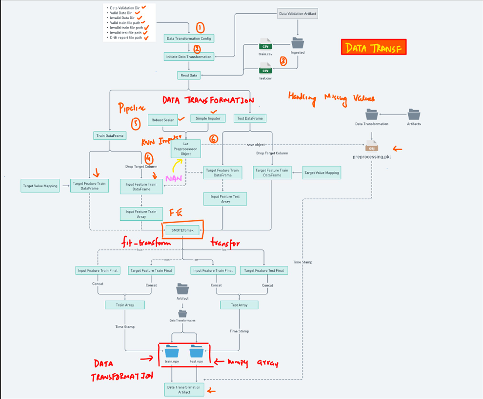
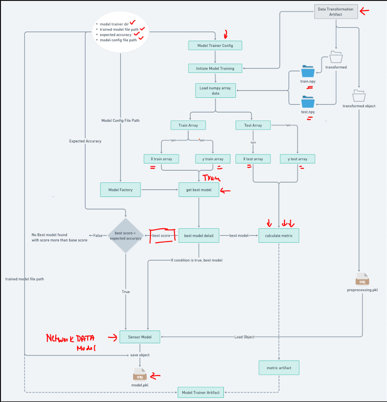
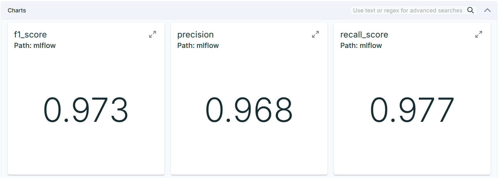
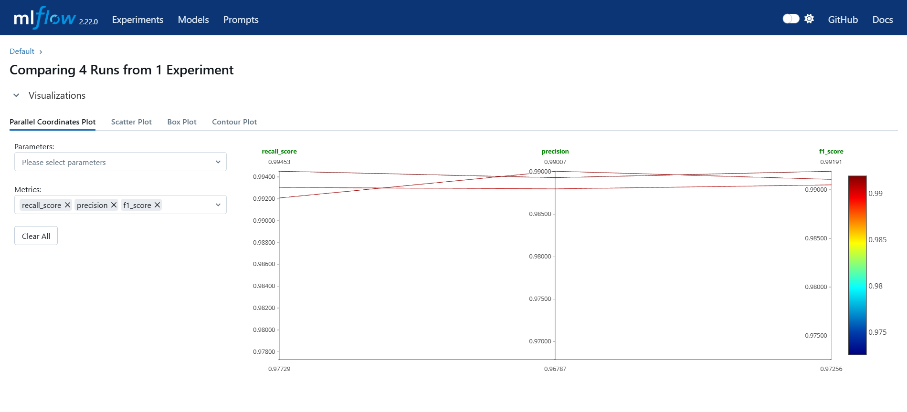
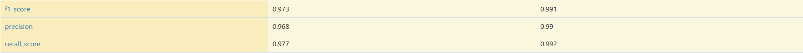
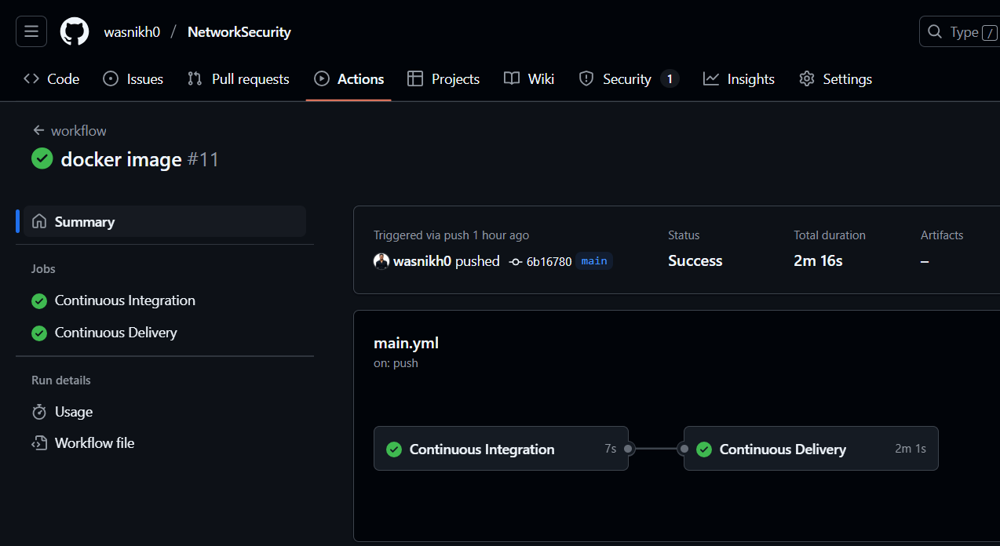

# 🛡️ End-to-End MLOps Project: Network Security Threat Detection

> **Built with industry-grade practices: ML pipeline automation, containerization, CI/CD deployment, cloud-native architecture.**

---

## 🚀 Overview

This project presents a **production-ready Machine Learning pipeline** developed around a network security dataset. While the dataset is domain-specific, the true focus was to **design a modular, real-world MLOps system** that could seamlessly integrate into any enterprise stack.

The pipeline was built with **automation, traceability, and deployment scalability** as primary goals. Everything — from data ingestion to cloud deployment — has been containerized, tracked, and versioned.

---

## 🎯 Project Objectives

- ✅ Build a reusable, extensible ML pipeline
- ✅ Automate data ingestion, transformation, training, evaluation, and deployment
- ✅ Implement **MLflow** for experiment tracking and model registry
- ✅ Use **Docker + AWS ECR/EC2** for containerized deployment
- ✅ Enable **CI/CD** via GitHub Actions to simulate a production rollout

---

## 🔄 Workflow Architecture

### 📊 ML Pipeline: Ingestion to Inference


### 📦 Modular Breakdown



Each block is modular and configurable using YAML configs. All logs, model files, and metrics are stored and versioned automatically.

---

## ⚙️ Pipeline Components

### 1️⃣ Data Ingestion (From MongoDB)



---

### 2️⃣ Data Validation



---

### 3️⃣ Data Transformation



---

### 4️⃣ Model Training & Evaluation

This component trains and evaluates multiple classification models to detect potential network intrusions. The following models were included:

- 🌲 **Random Forest**
- 🌳 **Decision Tree**
- 🚀 **Gradient Boosting**
- 📈 **Logistic Regression**
- ⚡ **AdaBoost**

Each model is evaluated using:
- `precision`
- `recall`
- `f1-score`

All models are trained on the transformed datasets with hyperparameter tuning and are logged into MLflow for comparison.

> ✅ `RandomForestClassifier` and `GradientBoostingClassifier` are trained with verbosity enabled to provide iterative training feedback.



---

### 📈 MLflow Tracking & Experimentation

MLflow is used to:
- Log metrics (accuracy, precision, recall, F1)
- Store trained models and preprocessing artifacts
- Compare performance visually across experiments

You can view each experiment by model type and choose the best-performing one using the F1-score.

> 🎯 In our tests, Random Forest and Gradient Boosting consistently outperformed others in terms of precision-recall balance.



### 🔍 Visual Comparison (Across 4 Runs)



### 📊 Metrics Table



---

## 🚀 CI/CD Pipeline

### GitHub Actions Workflow



---

## ☁️ Tech Stack

| Category                  | Tools Used                                                                 |
|---------------------------|-----------------------------------------------------------------------------|
| **Data Storage**          | MongoDB                                                                    |
| **ML Models & Preprocessing** | Random Forest, Gradient Boosting, Decision Tree, Logistic Regression, AdaBoost, Scikit-learn, Imbalanced-learn, NumPy |
| **Tracking**              | MLflow, DVC, Dagshub                                                                     |
| **Orchestration**         | Python scripts, YAML configs                                               |
| **Containerization**      | Docker                                                                     |
| **CI/CD**                 | GitHub Actions                                                             |
| **Cloud Deployment**      | Amazon ECR, EC2     

---

## 🧠 Challenges & Solutions

| Challenge                              | Solution |
|----------------------------------------|----------|
| Automating data drift detection        | Implemented data validation schema with drift logic |
| Managing multiple model experiments    | MLflow integration with metrics tracking and visual comparison |
| Avoiding manual deployment             | CI/CD setup via GitHub Actions |
| Ensuring model reproducibility         | All artifacts (model, preprocessing, metrics) versioned & stored |
| Cloud deployment configuration         | ECR + EC2 with secured credentials from GitHub secrets |

---

## 📌 Key Learnings

- End-to-end MLOps projects go far beyond model accuracy — it's about **designing scalable, maintainable systems**.
- Tracking, versioning, and reproducibility are as important as model performance.
- Real-world deployments benefit from **cloud-native, containerized infrastructure**.

---

## 🔍 How to Reproduce This Project

```bash
# 1. Clone the repository
git clone https://github.com/wasnikh0/NetworkSecurity.git
cd network-security-mlops

# 2. Set up virtual environment
python conda create -p venv python==3.10
source conda activate venv/  # or venv\Scripts\activate on Windows

# 3. Install dependencies
pip install -r requirements.txt

# 4. Create .env or setup secrets for MongoDB and AWS

# 5. Run the pipeline
python main.py  # Or run modular scripts

# 6. Build Docker image
docker build -t networksecurity .

# 7. Push to ECR (after aws login)
docker tag networksecurity:latest <aws_account_id>.dkr.ecr.<region>.amazonaws.com/<repository>:latest
docker push <aws_account_id>.dkr.ecr.<region>.amazonaws.com/<repository>:latest
```

---

## 📬 Contact

**👨‍💻 Author:** Harsh Wasnik  
📫 [LinkedIn](https://www.linkedin.com/in/harsh-wasnik)  
🛠️ Open to freelance, consulting, or full-time opportunities

---